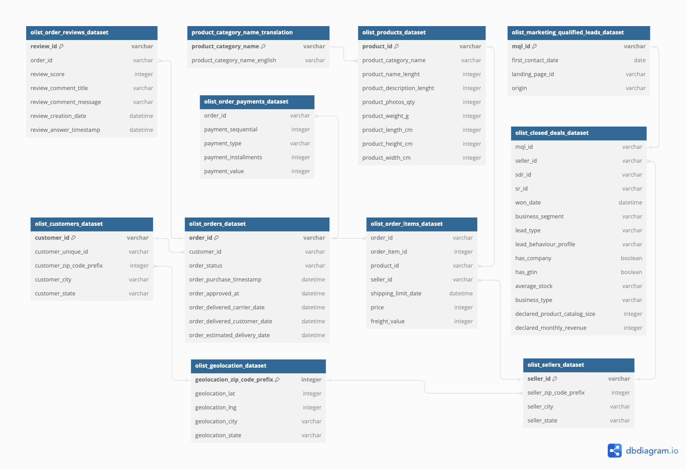
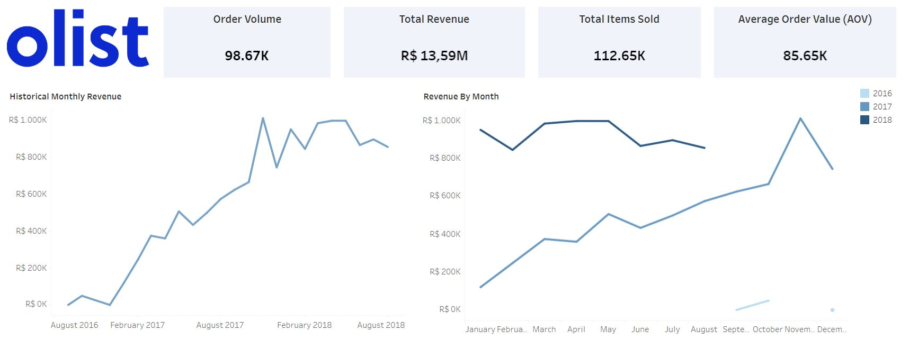
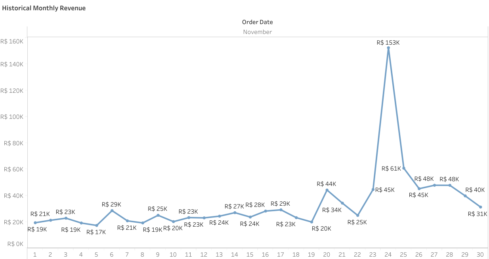
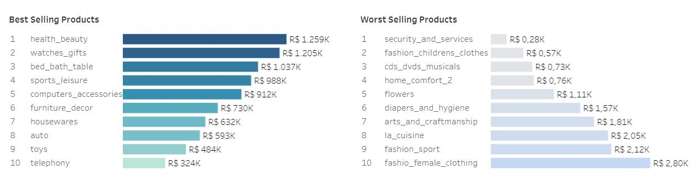
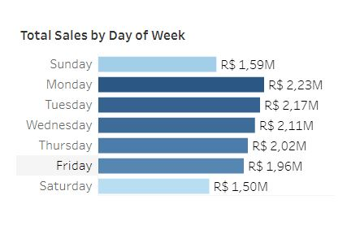

# Olist Sales Data Analysis
by Terrence Tolentino

# Project Background

Olist is a Brazilian e-commerce platform providing logistics and centralized management support for a wide range of sellers. Established in 2015, Olist operates in the e-commerce industry, specializing in streamlining the selling process for its partner merchants by consolidating their products into a unified marketplace. This business model allows sellers to focus on product offerings while Olist manages order fulfillment, logistics, and customer service.

The dataset contains information on orders, products, purchases, sellers, and customers from September 2016 - September 2018. This project analyzes and synthesizes these data in order to evaluate sales trends over time and across categories and as well as to identify the best and worst selling products in the platform.

Insights and recommendations are provided on the following key areas:
- **Overall Sales Trends Analysis:** Evaluation of historical sales patterns, focusing on Order Volume, Revenue, and Average Order Value (AOV). 
- **Product Category Performance:** Analysis of Olist’s best and worst products in
terms of orders and sales, understanding major products contributing to overall
revenue.

The technical documentation for this project, including the SQL queries used to inspect
and clean the data for analysis, the entire process of data manipulation, and the
targeted SQL queries regarding various business questions can be found [here](https://github.com/teejtolentino/Data-Projects/blob/182fac06468a54f35f6db7f26e371a5fd17f90a1/Olist%20Sales%20Data%20Analysis/Technical%20Documentation.md).

An interactive Tableau dashboard used to report and explore sales trends can be found [here](https://public.tableau.com/views/OlistSalesDashboard_17282128967370/Dashboard1?:language=en-US&:sid=&:redirect=auth&:display_count=n&:origin=viz_share_link).

# Data Structure & Initial Checks

The company's main database structure consists of eleven tables. However, for the
purposes of this project, we only utilize four tables namely: **orders**, **order_items**,
**products**, and **product_category name_translation**. A complete Entity Relationship
Diagram (ERD) of the database is shown below:

# Executive Summary

### Overview of Findings

Sales revenue started to rise in the beginning of 2017 and hit the R$1 million mark in
November of that year. Sales have continued to be steady ever since, driven by
top-performing categories like **health_beauty** and **watches_gifts**. Seasonal trends are
visible, with sales figures gaining momentum starting Quarter 4 of 2017 and have
consistently shown strong performance until Quarter 3 of 2018. Monday emerges as the
strongest sales day. Olist can optimize its sales strategy by focusing on high-yield
categories and considering the reallocation of resources from underperforming areas.
Overall, the data reveals positive growth in terms of order volume and revenue.

Below is an overview of the Tableau dashboard and more examples are shown
throughout the report. The entire interactive dashboard can be accessed [here](https://public.tableau.com/views/OlistSalesDashboard_17282128967370/Dashboard1?:language=en-US&:sid=&:redirect=auth&:display_count=n&:origin=viz_share_link).

The following sections explore these figures in detail and highlight key insights.

# Insights Deep Dive

### Overall Sales Trend:

* **Steady Revenue Growth with Peaks in 2017:** The company experienced rapid
revenue growth from August 2016 to early 2017, followed by stable, sustained
performance through mid-2018. The highest revenue spike occurred in
**November 2017**, reaching over R$1 million in monthly sales. The biggest spike
occurred on November 24, 2017 with gross sales amounting to R$153K. This
corresponds to **Black Friday**, which is a key shopping event in Brazil, where
consumers take advantage of major discounts and promotions.

  
* **Overall Positive Sales Growth:** There is a clear upward trajectory in revenue
over time from August 2016 to August 2018. This growth suggests that Olist’s
market presence and customer base have expanded, especially with key
moments like Black Friday driving significant spikes. The average order value
(AOV) also remains relatively stable, indicating consistent customer spending
habits.
  
* **Monthly Revenue Stability:** Apart from Black Friday, sales patterns show
relatively consistent revenue month to month, with minor fluctuations. This steady
growth signifies that while promotional events like Black Friday are impactful,
Olist’s revenue remains stable across non-peak months.
  
* **Year-on-Year Comparisons:** The data provides a breakdown by year, showing
increased sales in 2017 compared to previous years. This shows that Olist's
market penetration has improved, with 2017 being the highest performing year.
Monitoring year-over-year growth is key for setting future benchmarks and
performance goals.

### Product Category Performance:

* **Best-Selling Categories:** **Health_beauty** and **watches_gifts** were the
top-performing categories, contributing **R$ 1.259M** (9.26% of total revenue) and
**R$ 1.205M** (8.87%), respectively. These categories reflect consumer interest in
self-care and personal products. Other top-performing categories include Bed,
Bath & Table **(R$1.037K)** and Sports & Leisure **(R$988K)**. These categories perform consistently, indicating a well-diversified product offering that appeals to
a broad customer base.
  
* **Worst-Selling Categories:** **Security_and_services** (R$ 283) and
**fashion_childrens_clothes** (R$ 570) represent the lowest-performing
categories. These categories contribute negligible revenue to the overall total,
which suggests these categories are not resonating with Olist’s customers and
could benefit from either reevaluation or discontinuation.
  
* **Revenue Concentration:** The top five categories, including **bed_bath_table** and
sports_leisure, account for a combined **40% of total sales**, while the lowest ten
categories contribute less than **5%**. This indicates a heavy reliance on a few
categories to drive overall revenue.

### Sales by Day of the Week:

* **Monday and Tuesday as Peak Days:** The highest total sales are generated on
Mondays **(R$2.23M)** and Tuesdays **(R$2.17M)**. This highlights the start of the
week as a key time for customer purchases, which may be linked to promotional
strategies or consumer shopping habits at the beginning of the week.
  
* **Lower Weekend Sales:** Sundays and Saturdays show the lowest sales at
**R$1.59M** and **R$1.50M**, respectively. This suggests that weekend shopping is
less frequent for Olist customers. Further analysis could explore if
weekend-focused promotions could improve these figures.
  
* **Mid-week Stability:** Wednesday to Friday sees stable sales, averaging between
**R$2.11M** and **R$1.96M**. This steady pattern provides a baseline for performance
during non-peak days.
  
* **Opportunities for Optimizing Weekend Campaigns:** Given the dip in weekend
sales, there may be opportunities for implementing promotional campaigns
aimed specifically at driving Saturday and Sunday traffic, such as flash sales or
discounts.

# Recommendations:

Based on the insights and findings above, we would recommend to executives and/or
stakeholders to consider the following:

* **Black Friday Preparations:** Continue leveraging major sales events like Black
Friday for massive revenue boosts. This includes early preparation for inventory,
optimized logistics, and targeted marketing campaigns to capture increased
demand. Marketing budgets should prioritize this event, as it significantly impacts
annual revenue.
  
* **Focus on Top-Selling Categories:** Categories like Health & Beauty and
Watches & Gifts are strong performers. Investing in inventory expansion,
marketing, and customer engagement in these categories could further drive
growth.
  
* **Reassess Poor Performers:** Categories such as Security and Services and
Children’s Fashion consistently perform poorly. It would be prudent to either
phase out these categories or implement new marketing strategies to enhance
their appeal. Further research could identify whether these products align with
customer needs.
  
* **Leverage Monday and Tuesday Sales:** With the highest sales occurring early in
the week, Olist should enhance promotions for these days. Providing incentives
like additional discounts or free shipping on Mondays and Tuesdays may help
maintain strong performance.
  
* **Weekend Sales Campaigns:** Weekend sales are comparatively lower. Olist
could develop weekend-exclusive promotions or limited-time offers to attract
more shoppers on Saturdays and Sundays.
  

# Assumptions and Caveats:

Throughout the analysis, multiple assumptions were made to manage challenges with the data. These assumptions and caveats are noted below:

* **Black Friday as an Outlier:** The spike on November 24, 2017 (Black Friday)
was treated as an outlier, representing exceptional sales behavior rather than a
trend that would continue on non-peak days.
  
* **Data limitations:** The dataset does not include product-level cost data, which
would allow for a profitability analysis. Assumptions have been made that the
categories with higher sales are proportionally more profitable.
  
* **Incomplete Data for Certain Categories:** Some low-performing categories,
such as Security and Services, may lack complete data, and additional customer
feedback or competitor analysis could provide more context on why these
categories underperform.
