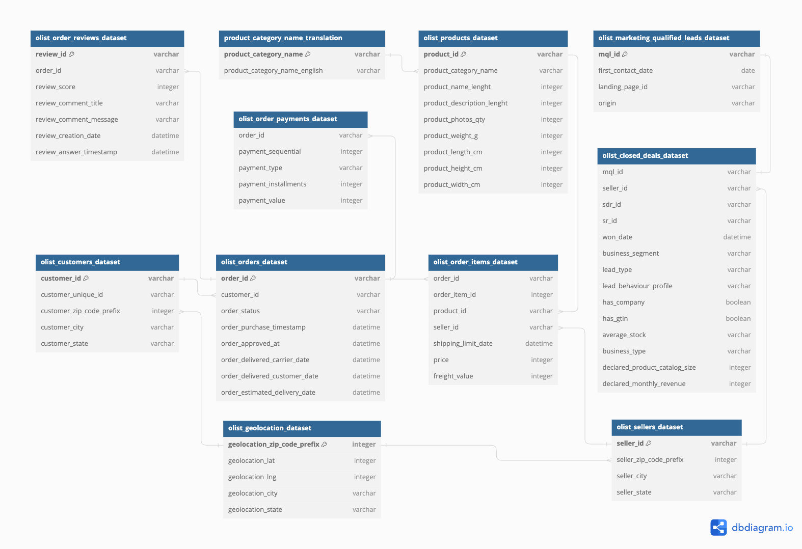

# Olist Sales Analysis Technical Documentation

### Data Preparation

* The data used in this project is the [Brazilian E-Commerce Public Dataset by Olist](https://www.kaggle.com/datasets/olistbr/brazilian-ecommerce) which is available for download in Kaggle.

* After downloading the data, I uploaded the csv files to Google Cloud's **BigQuery** as my chosen database.

* I then utilized **SQL** for data cleaning, exploration, and manipulation. The SQL queries used and the thought process are detailed in this documentation.

* After processing the data, I imported the final csv file to **Tableau Public** for further data exploration, visualization, and dashboard-building.

* The Olist dataset contains 11 tables. For the purposes of the project, however, I only use four
tables namely: **orders**, **order_items**, **products**, and **product_category_name_translation**. The full ERD of the dataset is found below:




### Data Processing

* **SQL Query #1: JOIN relevant tables**

  - Create a raw table joining all relevant tables from the dataset. The resulting table serves
as the order_sales_data table that we use all throughout the project.

  - This raw table serves as a backup table as well.

```

CREATE OR REPLACE TABLE `olist_dataset.order_sales_data_raw` AS
SELECT a.order_id, a.order_item_id, a.product_id, b.category, a.order_purchase_timestamp,
a.price
FROM (
  SELECT a.order_id, a.order_item_id, a.product_id, b.order_purchase_timestamp, a.price
  FROM `olist_dataset.order_items` a
  LEFT JOIN `olist_dataset.orders` b
  ON a.order_id = b.order_id
  ) a
LEFT JOIN (
  SELECT a.product_id, b.string_field_1 AS category
  FROM `olist_dataset.products` a
  LEFT JOIN `olist_dataset.product_category_name_translation` b
  ON a.product_category_name = b.string_field_0
  ) b
ON a.product_id = b.product_id
GROUP BY a.order_id, a.order_item_id, a.product_id, b.category, a.order_purchase_timestamp,
a.price
ORDER BY a.order_purchase_timestamp ASC, a.order_item_id ASC;

```

* **SQL Query #2: Data cleaning**

  - From the raw table created, create a new clean table. In the query below, we deal with
missing values in the ‘category’ column and then create a new clean table.

```

CREATE OR REPLACE TABLE `olist_dataset.order_sales_data` AS
SELECT DATE(order_purchase_timestamp) AS order_date, COALESCE(category, 'Unknown') AS
product_category,
FROM `olist_dataset.order_sales_data_raw`;

```

* **SQL Query #3: Data manipulation and aggregation**

  - We then create an order_total_sales table where we standardize the format of the data specifically dates and strings in columns: order_purchase_timestamp and product_category.

  - We then aggregate the product_category to create the fields: quantity_sold and total_sales.

```

-- SQL query that creates the total_sales table
CREATE OR REPLACE TABLE `olist_dataset.order_total_sales` AS
SELECT order_id, product_id, DATE(order_purchase_timestamp) AS order_date, LOWER(product_category) AS product_category, COUNT(product_category) AS quantity_sold, price, COUNT(product_category) * price AS total_sales
FROM `olist_dataset.order_sales_data`
GROUP BY order_id, product_id, order_date,
product_category, price
ORDER BY order_date, product_category;

```

* **SQL Query #4: Perform calculations and add fields to the table**

  - Now that we have information on quantity_sold and total_sales, we can now calculate for the Average Order Value (AOV) which is a key metric for our analysis.
 
```

-- SQL query that creates avg_order_value table
CREATE OR REPLACE TABLE `olist_dataset.order_avg_order_value` AS
SELECT order_date, SUM(total_sales) / COUNT(DISTINCT order_id) AS avg_order_value
FROM `olist_dataset.order_total_sales`
GROUP BY order_date
ORDER BY order_date;

```

* **SQL Query #5: Finalize the table and prepare for export**

  - Finalize the table that will be exported from BigQuery and then imported to Tableau
Public for further exploration, data visualization, and dashboarding.

```

CREATE OR REPLACE TABLE `olist_dataset.order_sales_avg_value` AS
SELECT a.order_id, a.product_id, a.order_date, a.product_category, a.quantity_sold, a.price,
a.total_sales, b.avg_order_value
FROM `olist_dataset.order_total_sales` a
JOIN `olist_dataset.order_avg_order_value` b
ON a.order_date = b.order_date
ORDER BY a.order_date;

```

* **SQL Query #6: Pull the final table**

  - Pull the final table, export as a csv file, and import to Tableau for visualization.

```

-- Pulls the order_sales_avg_value table to be exported
SELECT *
FROM `olist_dataset.order_sales_avg_value`;

```


# Conclusion

* The final resulting table now contains all the relevant information we need for our analysis. We now export the table to a csv file and then import it to Tableau. A glimpse of the final dataset is found below:


* The complete dataset can be found [here]

* The interactive sales dashboard can be found [here](https://public.tableau.com/views/OlistSalesDashboard_17282128967370/Dashboard1?:language=en-US&:sid=&:redirect=auth&:display_count=n&:origin=viz_share_link)
